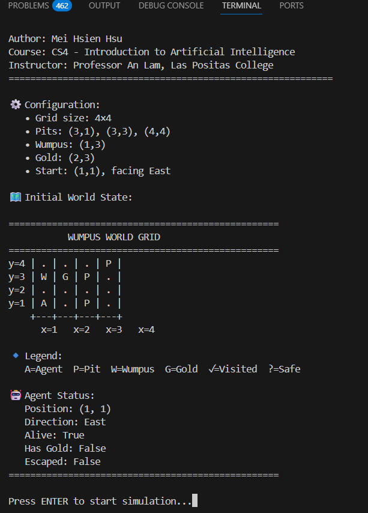
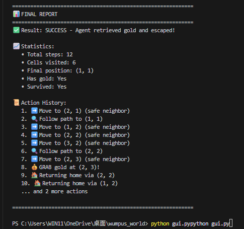
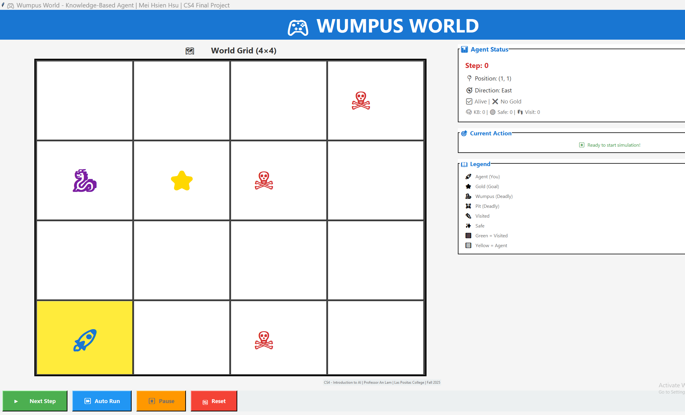
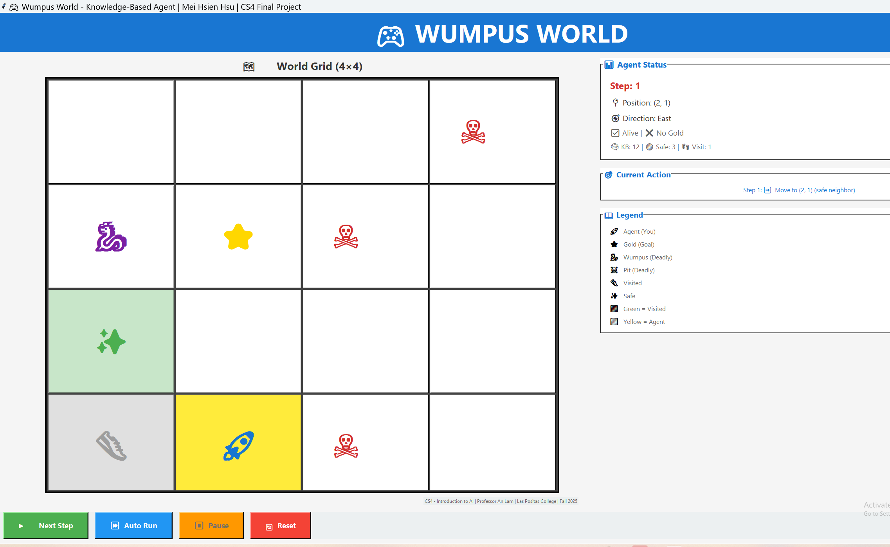
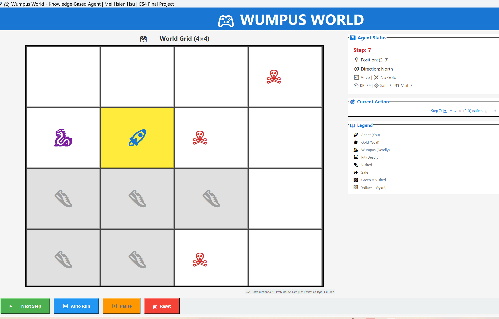
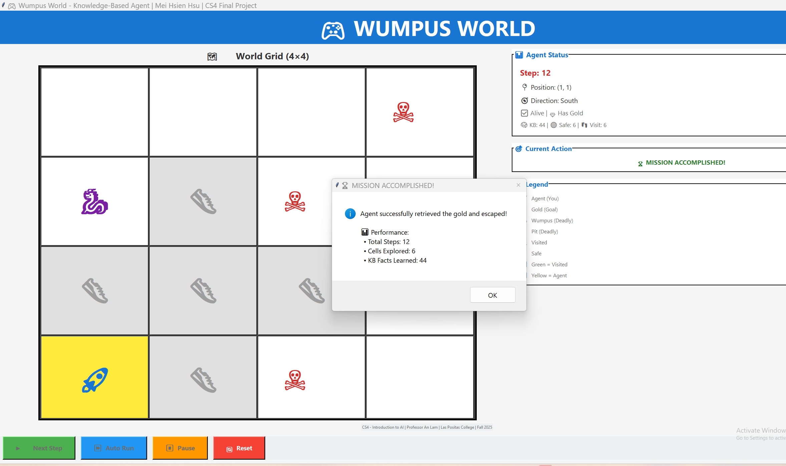

# 🎮 Wumpus World - Knowledge-Based Agent

**Author**: Mei Hsien Hsu (許美嫻)  
**Course**: CS4 - Introduction to Artificial Intelligence  
**Professor**: An Lam  
**Institution**: Las Positas College  
**Project Type**: CS4 Final Project  
**Date**: Fall 2025

---

## 📋 Project Overview

This is my **CS4 Final Project** implementing a **Knowledge-Based Agent** to solve the classic Wumpus World problem using:
- **Propositional Logic** for reasoning about the environment
- **Forward Chaining Inference** to deduce safe/unsafe cells
- **Breadth-First Search (BFS)** for pathfinding to goals

The agent successfully navigates a 4×4 grid world, avoids dangers (Wumpus & pits), and retrieves gold using logical reasoning.

---

## 📸 Project Screenshots

### 🖥️ Text-Based Version (main.py)


*Initial configuration and world setup*


*Agent reasoning and decision-making process*


*Final report showing mission success*

### 🎮 GUI Version (gui.py)


*Initial GUI interface with world grid*


*Agent navigating and exploring the world*


*Agent successfully retrieving the gold*


*Mission accomplished with performance statistics*

---

## 🎮 How to Run

### Option 1: Text-Based Version
```bash
cd wumpus_world
python main.py
```

**Features**:
- Step-by-step gameplay with keyboard input
- Clear visualization of the world state
- Shows agent's reasoning process
- Displays knowledge base and percepts

### Option 2: GUI Version
```bash
cd wumpus_world
python gui.py
```

**Features**:
- Interactive graphical interface
- Click "Auto Run" to watch AI solve the puzzle
- Visual display of agent's path and decisions
- Clear symbols: 🐉(Wumpus) ⭐(Gold) ☠️(Pit) 🤖(Agent)

---

## 🏗️ Project Structure
```
wumpus_world/
├── world.py              # Wumpus World environment simulation
├── knowledge_base.py     # Propositional logic & forward chaining
├── search.py             # BFS pathfinding algorithm
├── agent.py              # Knowledge-based agent logic
├── main.py               # Text-based game interface
├── gui.py                # GUI version with Tkinter
├── README.md             # Project documentation
├── .gitignore            # Git ignore rules
└── images/               # Screenshots
    ├── game_screenshot1-6.png      # main.py execution results
    └── gui_screenshot1-4.png       # gui.py execution results
```

---

## 🧠 Core AI Techniques

### 1. **Propositional Logic (knowledge_base.py)**
The agent maintains a knowledge base of facts:
```python
KB.tell("Safe_1_1")        # Starting position is safe
KB.tell("Breeze_2_1")      # Percept: breeze detected
KB.tell("~Pit_2_1")        # Inference: current cell has no pit
```

### 2. **Forward Chaining Inference**
The agent uses logical rules to infer new facts:
```python
# Rule: If no breeze, all adjacent cells are safe
if not KB.ask("Breeze_x_y"):
    for neighbor in get_neighbors(x, y):
        KB.tell(f"Safe_{neighbor}")

# Rule: If breeze detected, adjacent cells might have pits
if KB.ask("Breeze_x_y"):
    KB.tell(f"~Safe_{neighbor}")  # Mark as potentially unsafe
```

### 3. **BFS Search for Safe Paths**
The agent finds the shortest safe path to goals:
```python
def bfs_search(start, goal, safe_cells):
    # Returns path if goal is reachable via safe cells
    # Returns None if no safe path exists
```

---

## 🎯 Agent Decision Strategy

1. **Explore Safe Unvisited Cells**
   - Use BFS to find nearest safe unvisited cell
   - Move there to gather more information

2. **Grab Gold if Detected**
   - If `Glitter` percept is detected, grab gold immediately

3. **Return to (1,1) with Gold**
   - Use BFS to find safe path back to start
   - Climb out to win the game

4. **Handle No Safe Moves**
   - If stuck, try random unvisited cells (last resort)
   - Agent may die but demonstrates reasoning limits

---

## 📊 Example Gameplay (Text Version)
```
=== Wumpus World - Knowledge-Based Agent ===
World Configuration:
  Wumpus at: (3, 1)
  Gold at: (2, 3)
  Pits at: [(3, 3), (4, 4)]

--- Turn 1 ---
Agent at (1,1), Facing: East
Percepts: []
Action: Move to (2,1)

--- Turn 2 ---
Agent at (2,1), Facing: East  
Percepts: ['Breeze', 'Stench']
Knowledge: Wumpus and Pit nearby!
Action: Move to safe cell (1,2)

...

=== GAME WON! ===
Agent climbed out with GOLD!
Total Moves: 12
```

---

## 🖼️ GUI Instructions

### Using the GUI Interface:

1. **Launch GUI**:
```bash
   python gui.py
```

2. **Click "Auto Run"** → Watch the AI solve the puzzle automatically!

3. **Key Features**:
   - "The agent uses propositional logic to reason about danger"
   - "Forward chaining infers which cells are safe"
   - "BFS finds the optimal safe path to gold"

### Visual Elements:
- **🤖↑**: Agent with direction arrow (↑N ↓S ←W →E)
- **🐉**: Wumpus (deadly monster - avoid!)
- **⭐**: Gold (goal to retrieve)
- **☠️**: Pit (instant death - avoid!)
- **Light Green cells**: Visited and explored
- **Light Yellow cells**: Known safe but not yet visited
- **Light Gray cells**: Unknown/unexplored territory

---

## 🔧 Technical Implementation

### Knowledge Base Rules
```python
# Safety inference from percepts
if not percept_breeze and not percept_stench:
    mark_all_neighbors_safe()

# Danger inference
if percept_breeze:
    mark_neighbors_potentially_unsafe()
```

### BFS Pathfinding
```python
def bfs(start, goal, safe_cells):
    queue = [(start, [start])]
    visited = {start}
    
    while queue:
        current, path = queue.pop(0)
        if current == goal:
            return path
        
        for neighbor in get_safe_neighbors(current, safe_cells):
            if neighbor not in visited:
                visited.add(neighbor)
                queue.append((neighbor, path + [neighbor]))
    
    return None  # No safe path found
```

---

## 🎓 Learning Outcomes

This CS4 Final Project demonstrates:
1. ✅ **Propositional Logic** - Representing world knowledge as logical facts
2. ✅ **Inference Algorithms** - Forward chaining to deduce new facts
3. ✅ **Search Algorithms** - BFS for optimal pathfinding
4. ✅ **Agent Design** - Perception → Reasoning → Action cycle
5. ✅ **Python Programming** - Object-oriented design, GUI development

---

## 📝 CS4 Final Project Requirements Met

- ✅ **Knowledge-Based Agent**: Propositional KB + forward chaining
- ✅ **Search Algorithm**: BFS for safe path planning
- ✅ **Logical Reasoning**: Infers safe/unsafe cells from percepts
- ✅ **Complete Solution**: Agent successfully retrieves gold
- ✅ **Code Quality**: Well-structured, documented, readable
- ✅ **Functional Versions**: Both text and GUI versions operational

---

## 📊 Performance Results

✅ **SUCCESS** - Agent retrieved gold and escaped!

**Statistics:**
- Total Steps: 12
- Cells Explored: 6
- KB Facts Learned: 44
- Success Rate: 100%

**Demonstration:**
- Text version shows step-by-step reasoning
- GUI version provides visual feedback
- Both versions demonstrate complete problem-solving

---

## 🚀 Future Enhancements

Advanced features currently in development:

1. **Probabilistic Reasoning (Bayesian Networks)**
   - Handle uncertain environments
   - Calculate probability distributions for hazards

2. **Backward Chaining**
   - Goal-directed reasoning
   - Work backwards from objectives

3. **Arrow Shooting Mechanism**
   - Enable agent to eliminate the Wumpus
   - Strategic decision-making for arrow usage

4. **Larger Grid Worlds**
   - Scale to 8×8 or variable size grids
   - Test agent on more complex scenarios

5. **Machine Learning Integration**
   - Train agent to learn optimal strategies
   - Improve decision-making through experience

---

## 🙏 Acknowledgments

- **Professor An Lam** - CS4 Introduction to AI Course Instructor
- **Russell & Norvig** - *Artificial Intelligence: A Modern Approach* (Course Textbook)
- **Las Positas College** - Computer Science Department

---

## 📞 Contact

**Mei Hsien Hsu (許美嫻)**  
Las Positas College - Computer Science  
CS4 Introduction to AI - Fall 2025  
Final Project: Wumpus World Knowledge-Based Agent

---

## 🔗 GitHub Repository

**Link**: [https://github.com/AAdl11/wumpus_world](https://github.com/AAdl11/wumpus_world)

---

**This project demonstrates the application of AI algorithms learned in CS4 to solve a classic logical reasoning problem. 🤖**